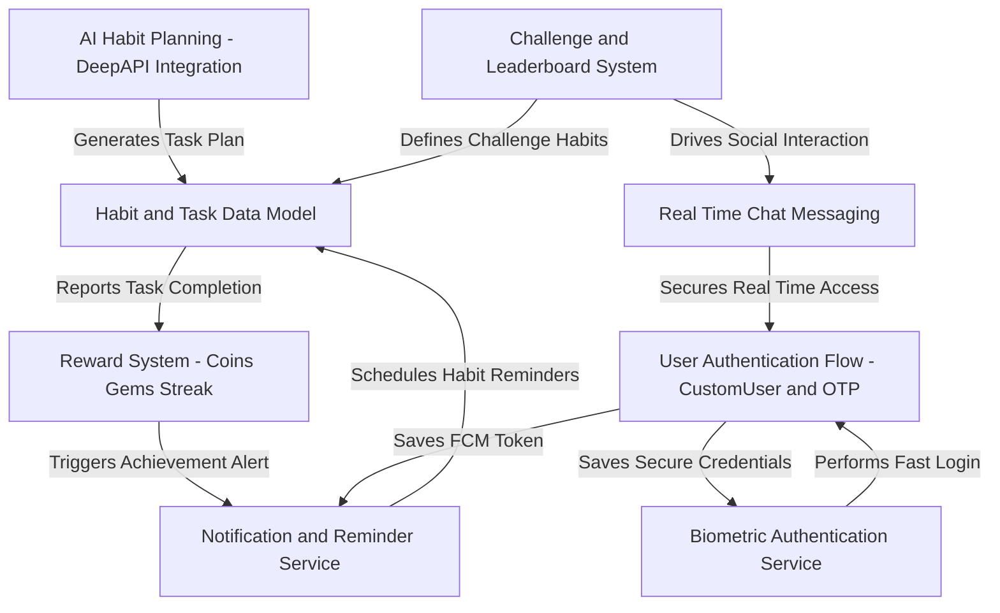
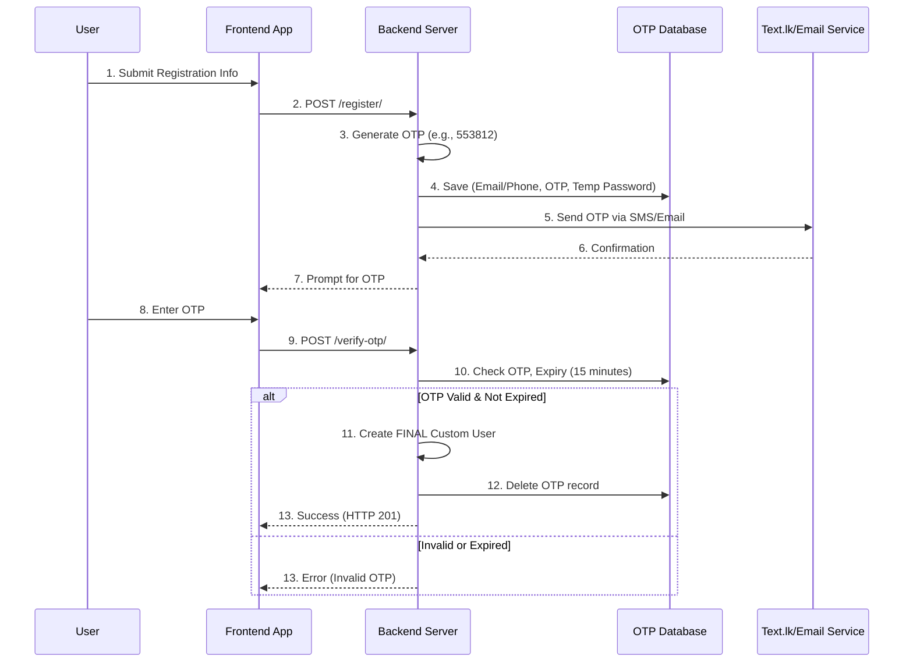
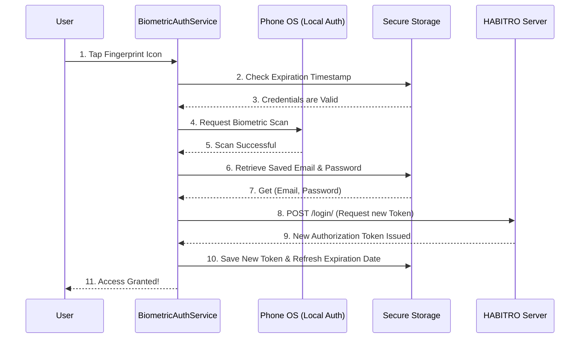
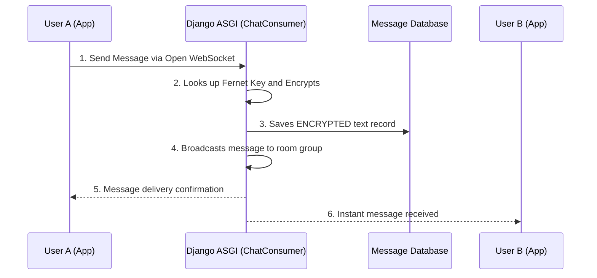

# Project-HABITRO: AI-Powered Habit Building & Gamification Platform

**Project-HABITRO** is a holistic habit-building application centered around personalized growth. It leverages **AI Habit Planning** to create custom routines, drives engagement through a **Gamified Reward System**, and fosters community through **Challenges** and **Real-Time Chat**.

## 🏗 System Architecture Overview

The system creates a cohesive loop between planning, execution, and reward.




---

## 🔐 Identity Management (Auth & OTP)

We utilize a flexible **CustomUser** model that allows registration via **Email** or **Phone Number**, verified via a secure One-Time Password (OTP) flow.

### Feature Comparison

| Feature             | Description                                       | Benefit                                 |
| ------------------- | ------------------------------------------------- | --------------------------------------- |
| **Email or Phone**  | Sign up using `john@email.com` or `+947XXXXXXXX`. | Maximum accessibility.                  |
| **Combined Fields** | Database stores both, but only one is required.   | Future flexibility for contact methods. |

### Backend Registration Flow

The backend uses a temporary staging table (`OTPVerification`) before creating the permanent user.



---

## 👆 Biometric Authentication

To balance security with convenience, the **Biometric Authentication Service (BAS)** uses local device capabilities (Fingerprint/FaceID) to securely store credentials and refresh session tokens automatically .

### Architecture Components

| Component              | Role                                       | Tool Used              |
| ---------------------- | ------------------------------------------ | ---------------------- |
| **Local Device Check** | Performs the actual fingerprint/face scan. | `local_auth` (Flutter) |
| **Secure Vault**       | Stores encrypted credentials locally.      | `FlutterSecureStorage` |
| **Backend Refresh**    | Uses saved creds to get a fresh API token. | Standard `/login/` API |

### Biometric Login Flow

When a user scans their fingerprint, the app retrieves credentials from the vault and re-authenticates with the server.



---

## 🤖 AI Habit Planning (DeepAPI)

This module transforms a vague user goal into a concrete, 21-day actionable plan using **DeepSeek via OpenRouter** .

### The Planning Workflow

1. **Classification:** AI determines if the habit is "Good" (build) or "Bad" (quit).
2. **Context Gathering:** AI generates dynamic questions based on user motivation.
3.

**Task Generation:** AI creates a structured 21-day schedule .

### System Prompt Logic (Backend)

The backend structures the prompt to ensure the AI returns machine-readable data.

```python
# backend/analyze_responses/views.py
system_prompt = (
    "You are an AI habit coach. Generate a personalized task plan over {days} days.\n"
    "Each day should have exactly 3 short, actionable tasks.\n"
    "IMPORTANT RULES:\n"
    "1. Tasks must be unique and show logical progression.\n"
    "2. Tasks should incorporate user's motivation and obstacles.\n"
    "\n"
    "Return the output in this format:\n"
    "Day 1:\n1. Unique task one\n2. Unique task two\n3. Unique task three\nDay 2:\n..."
)

```

---

## 📅 Habit & Task Data Model

We separate the high-level goal (**Habit**) from the daily execution items (**Task**) to track progress accurately .

### The Blueprint vs. Bricks

* **Habit:** The parent container (Goal, Duration, Type).
*

**Task:** The individual daily record (Date, IsCompleted status) .

### Dynamic Filtering (Serializer)

The backend only sends tasks relevant to *today* to keep the UI clean.

```python
# backend/analyze_responses/serializers.py
class HabitSerializer(serializers.ModelSerializer):
    tasks = serializers.SerializerMethodField() 

    def get_tasks(self, habit):
        # 1. Get today's date
        today = date.today()
        # 2. Filter tasks ONLY for this habit and ONLY for today
        tasks = habit.tasks.filter(date=today)
        return TaskSerializer(tasks, many=True).data

```

---

## 💎 Gamified Reward System

User retention is driven by three pillars: **Coins** (daily tasks), **Gems** (premium/streaks), and **Consistency Streaks**.

### Streak Cycle Rewards

Rewards escalate over a 7-day cycle to encourage daily logins.

| Day in Streak Cycle | Reward (Gems)            |
| ------------------- | ------------------------ |
| Day 1               | 0.1 Gems                 |
| Day 7 (Peak)        | 1.0 Gems                 |
| Day 8               | Cycle repeats (0.1 Gems) |

### Streak Claim Logic (Backend)

```python
# backend/rewards/views.py
def claim_streak(request):
    reward = Reward.objects.get(user=request.user)
    today = timezone.localtime(timezone.now()).date()
    last_claim_date = timezone.localtime(reward.last_claim_date).date()

    # 1. Check if the streak is continuing (Last claim was exactly yesterday)
    if (today - last_claim_date).days == 1:
        reward.daily_streak += 1
        reward.streak_cycle_day = (reward.streak_cycle_day + 1) % 7
    else:
        # 2. Streak broken or first claim - reset
        reward.daily_streak = 1
        reward.streak_cycle_day = 0
    
    # ... Update gems and save ...

```

---

## 🔔 Notification Service

We employ a dual-notification strategy to handle offline schedules and online events.

| Notification Type | Origin          | Internet? | Use Case                               |
| ----------------- | --------------- | --------- | -------------------------------------- |
| **Local**         | Phone (Flutter) | No        | Daily scheduled habit reminders.       |
| **Remote**        | Server (FCM)    | Yes       | "Achievement Unlocked," Social alerts. |

### Scheduling Local Reminders (Flutter)

```dart
// services/notification_service.dart
static Future<void> scheduleNotification({
  required String habitId,
  required String habitName,
  required TimeOfDay time, 
}) async {
  await _plugin.zonedSchedule(
    habitId.hashCode, // Unique ID
    '$habitName Reminder',
    'Don\'t forget to work on "$habitName" today!',
    scheduledDate,
    const NotificationDetails(
        android: AndroidNotificationDetails(
            // ... 
            matchDateTimeComponents: DateTimeComponents.time, // RECURS DAILY
        )
    ),
    // ...
  );
}

```

---

## 🏆 Challenges & Leaderboards

### Challenges

Users join group goals. The backend creates a `UserChallenge` record and individual `ChallengeHabit` tracking records for every habit in the challenge .

### Leaderboard Calculation

Rankings are based on **Completion Rate**, not just total points.

### Backend Aggregation Query

We calculate this efficiently using Django annotations.

```python
# backend/profileandchat/leaderboard_service.py
users = User.objects.annotate(
    total_tasks=Count('habits__tasks', filter=Q(habits__tasks__date__gte=start_date)),
    completed_tasks=Count('habits__tasks', filter=Q(habits__tasks__isCompleted=True) & Q(habits__tasks__date__gte=start_date))
).annotate(
    completion_rate=Coalesce(
        ExpressionWrapper(100.0 * F('completed_tasks') / NullIf(F('total_tasks'), 0)), 0.0
    )
).order_by('-completion_rate')

```

---

## 💬 Real-Time Chat (WebSockets)

Instant messaging is powered by **Django Channels (ASGI)** and **WebSockets**. Messages are **Fernet Encrypted** at rest.

### Message Journey



### Private Deletion

Deletion only hides the message from the user who requested it, preserving the chat history for the other party.

```python
# backend/profileandchat/models.py
class Message(models.Model):
    is_deleted_by_sender = models.BooleanField(default=False)
    is_deleted_by_receiver = models.BooleanField(default=False)
    
    def is_visible_to_user(self, user):
        if user == self.sender:
            return not self.is_deleted_by_sender
        # ... check receiver ...

```

---

